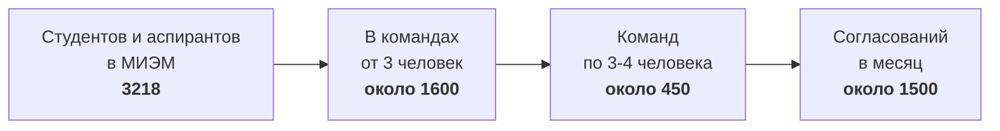
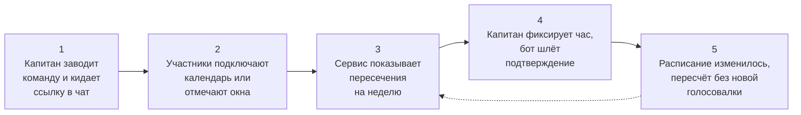
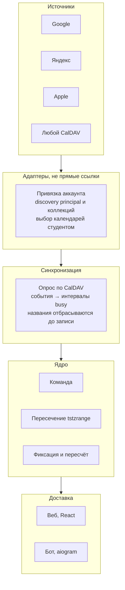
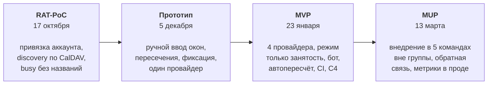
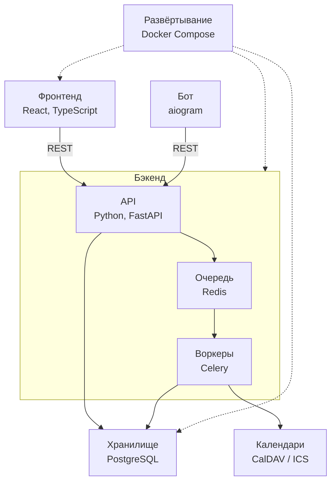
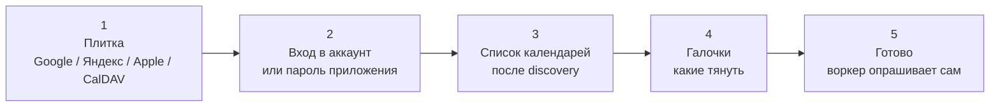
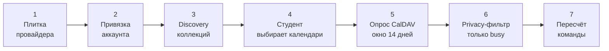

# Босс 1. Представление проекта «Сервис поиска общего слота для встречи учебной команды»

Защита 19 сентября, 5 минут доклад плюс 2 минуты вопросы. Загрузка презентации до 19 сентября 11:00.

---

## 1. Данные опроса

Собрано 19 ответов 16, 17 и 18 сентября 2026. Один респондент (3 курс, Физтех) в командах от трёх человек не работал и в расчёт не входит. Итоговая выборка **N = 18**.

Состав, 17 человек из МИЭМ и 1 из ИУ, 13 человек с 4 курса и 5 с 3 курса. Все работают или работали в команде от трёх человек.

### Частота и цена проблемы

| Показатель | Значение |
| --- | --- |
| Согласуют слот 2-4 раза в месяц или чаще | 14 из 18 (78%) |
| Хотя бы раз встреча срывалась или пришли не все | 13 из 18 (72%), из них 2 регулярно |
| Тратят на согласование 2-3 дня и больше | 10 из 18 (56%), включая 1 «неделя и больше» и 2 «часто буксует» |
| Считают приемлемым максимумом сутки или меньше | 13 из 18 (72%) |

Две последние строки и есть проблема в одной цифре. Больше половины тратят от двух дней, при том что 72% сами называют сутки предельным сроком.

### Что раздражает (множественный выбор)

| Раздражитель | Доля |
| --- | --- |
| Расписание у кого-то изменилось, согласуем заново | 12 из 18 (67%) |
| Ждать, пока все ответят | 11 из 18 (61%) |
| Вручную сравнивать чужие сетки часов | 8 из 18 (44%) |
| Окно формально общее, но неудобное | 6 из 18 (33%) |
| Всё устраивает | 1 из 18 (6%) |

### Как назначают время сейчас (множественный выбор)

| Способ | Доля |
| --- | --- |
| Голосовалка в чате | 14 из 18 (78%) |
| Каждый скидывает расписание, кто-то сводит вручную | 10 из 18 (56%) |
| Ставят первый свободный слот без согласования | 4 из 18 (22%) |
| По традиции с прошлой встречи | 4 из 18 (22%) |
| Пробуют специальные сервисы | 1 из 18 (6%), Doodle |

### Почему не берут готовые сервисы

| Причина | Доля |
| --- | --- |
| Расписание всё равно вносить руками каждый раз | 8 из 18 (44%) |
| Не пробовал и не слышал | 6 из 18 (33%) |
| Ссылку никто не открывает или надо логиниться | 6 из 18 (33%) |
| Для команды, которую видишь каждую неделю, слишком жирно | 4 из 18 (22%) |
| Непонятно, кто подтвердил | 4 из 18 (22%) |
| Используем и довольны | 1 из 18 (6%) |

### Готовность подключить календарь

| Ответ | Доля |
| --- | --- |
| Да, но только расписание пар без личных событий | 8 из 18 (44%) |
| Да, без колебаний | 4 из 18 (22%) |
| Зависит от запрашиваемых разрешений | 4 из 18 (22%) |
| Скорее нет | 2 из 18 (11%) |

12 из 18 согласны сразу, и две трети из них с оговоркой про личные события. Это продуктовое требование, а не пожелание.

### Где живёт расписание (множественный выбор)

Google Calendar 8, HSE App X 7, Яндекс.Календарь 3, Apple Calendar 3, не ведут календарь 2, фотографии расписания в чатах 1, «приложение какое-то рандомное» 1.

### Оценка трёх наших гипотез (шкала 1-5)

| Фича | Среднее | Оценок 4-5 |
| --- | --- | --- |
| Расписание изменилось, пересечения пересчитались сами | 4.22 | 14 из 18 |
| Видно, кто подтвердил вручную, а у кого отметка автоматическая | 4.11 | 14 из 18 |
| История встреч, повторные слоты из прошлых | 3.72 | 11 из 18 |

Порядок гипотез после добавления нового ответа не изменился, разрыв даже вырос. История встреч, которую мы в согласовании темы заявили как одно из главных отличий, остаётся самой слабой из трёх. Она переносится из MVP в MUP, и это надо проговорить вслух как реакцию на собственные данные.

### Респондент, который говорит «нет»

Ответ от 18 сентября (3 курс, ИУ) выбивается из выборки и поэтому полезен. Человек согласует встречи еженедельно, страдает ровно от тех же трёх вещей (ждать всех, сравнивать сетки вручную, расписание поменялось), но все три наши фичи оценил на 1, 2 и 1, календарь давать не хочет и ведёт расписание в «каком-то рандомном приложении». Его худший случай сформулирован иначе, чем у остальных, «не нашлось варианта для встречи единого».

Это другая проблема. У него не долгое согласование, а физическое отсутствие пересечения, и наш продукт её не решает. Если вопрос про скептиков прозвучит, честный ответ звучит так. Продукт работает там, где расписание уже живёт в календаре. Без этого он деградирует до обычного When2Meet, и мы это видим в данных.

### Цитаты для слайда проблемы (дословно)

- «Три недели согласовывали одну встречу»
- «Пересобирали слот четыре раза из-за отмен, в итоге встреча в 23:00, пришли трое из шести»
- «Один человек не приходил на созвоны, потому что просто не согласовывал слоты и жаловался, что ему неудобно»

---

## 2. Соответствие минимуму по пяти аспектам

Проверочная таблица, чтобы ни один аспект не потерялся при сборке слайдов.

| Аспект | Где закрыт | Чем именно |
| --- | --- | --- |
| Продукт | слайд 5 | цель сформулирована одним предложением, показан сквозной сценарий из пяти шагов от создания команды до пересчёта после срыва пары |
| Польза | слайды 2 и 3 | проблема с цитатами и цифрами, отдельная колонка с тем, как её решают сейчас без нас, включая главного конкурента «ничего не менять» |
| Пользователь | слайд 4 | портрет студента 3-4 курса МИЭМ, вторая роль капитана, количественная оценка аудитории внутри вуза и за его пределами |
| Технология | слайды 9 и 10 | пайплайн занятости через адаптеры, не прогрузка по ICS-ссылкам; стек; сравнение с Google API и с сырым импортом |
| Планирование | слайд 11 | этапы RAT-PoC, Прототип, MVP и MUP с привязкой к контрольным точкам курса |

---

## 3. Наброски интерфейса, что показываем на слайде 6

Три низкодетальных вайрфрейма, сознательно без цвета, теней и 3D. Это черновики, а не дизайн, и именно так их надо назвать вслух.

### Набросок 1. Неделя команды

Основной экран. Сверху навигация по неделям со стрелками и подписью «Сентябрь 2026, неделя 3». Сетка 7 колонок по дням недели на 12 строк по часам с 9:00 до 20:00.

Ячейки залиты четырьмя градациями серого по числу свободных участников, от нуля до трёх. Легенда с этой шкалой стоит внизу экрана. Синей рамкой выделен блок в среду с 14:00 до 16:00, это предложенный системой слот.

Справа панель состава из трёх человек, у каждого одно из трёх состояний. Закрашенный кружок означает «свободен по календарю», галочка «подтвердил вручную», пустой кружок «не отметился». Под списком та же легенда словами.

Что показывает набросок. Пересечение окон, происхождение каждой отметки и видимость того, кто ещё молчит. Это три вещи, которые мы заявляем как отличие, и все три видны на одном экране.

### Набросок 2. Карточка слота

Одна карточка со скруглёнными углами. Сверху крупно «Ср, 19:00–20:00». Ниже три участника, у первого отметка «подтвердил», у двух остальных «не ответил» серым.

Под списком строка «двое ещё не ответили» и рядом кнопка «Напомнить». Внизу крупная тёмная кнопка «Зафиксировать слот».

Что показывает набросок. Капитан пингует двоих поимённо, а не весь чат. Это прямой ответ на 11 ответов «ждать, пока все ответят».

### Набросок 3. Подключение календаря

Заголовок «Подключить календарь». Четыре плитки сеткой два на два: Google, Яндекс, Apple, «Другой CalDAV». Это мастер привязки аккаунта, не поле «вставьте ссылку на календарь».

После выбора плитки короткий шаг: для Яндекса и Apple — пароль приложения со ссылкой в настройки безопасности провайдера; для «Другой CalDAV» — сервер, который мы сами обнаруживаем, а не сырой `.ics`. Затем список календарей галочками. Под списком переключатель «Показывать только занятость, без названий событий» во включённом положении. Внизу кнопка «Подключить».

Что показывает набросок. Студент не скармливает прямые ссылки на календари всех сервисов. Он привязывает учётную запись, выбирает коллекции, и импорт дальше идёт протоколом. Тумблер надо прокомментировать голосом: 8 из 18 дадут календарь только без личных событий.

### Что поправить перед сдачей

На первом наброске предложенный слот стоит в среду днём, а на карточке время другое. Для защиты это не критично, но если успеете, сведите к одному времени, тогда три экрана читаются как один сценарий.

---

## 4. Структура презентации, 12 слайдов

Порядок соответствует требованию курса. Постановка проблемы это слайды 2 и 3, целевая аудитория слайд 4, решение слайды 5 и 6, конкурентный анализ слайды 7 и 8, технологии слайды 9 и 10, план развития слайд 11, метрики успеха слайд 12.

| Слайд | Содержание | Визуал | Секунд |
| --- | --- | --- | --- |
| 1 | Титул, название, состав команды | сетка недели с подсвеченным окном | 10 |
| 2 | Проблема, три цитаты и одна цифра | скриншот реальной голосовалки в чате | 35 |
| 3 | Как решают сейчас и почему сервисы не приживаются | две колонки с долями | 25 |
| 4 | Портрет пользователя и размер аудитории | воронка расчёта | 35 |
| 5 | Решение, сквозной сценарий | горизонтальная схема из пяти шагов | 45 |
| 6 | Наброски интерфейса | три вайрфрейма | 25 |
| 7 | Конкурентный анализ | матрица сравнения | 35 |
| 8 | Отличия и non-goals | четыре пункта плюс список исключений | 25 |
| 9 | Архитектура и стек | пайплайн: адаптеры → занятость → ядро | 30 |
| 10 | Сравнение с альтернативой и риски | не Google API и не сырые ICS-ссылки | 30 |
| 11 | План развития | таймлайн с контрольными точками | 20 |
| 12 | Метрики успеха | таблица с целевыми значениями | 25 |
| | | **Итого** | **5:20** |

Двадцать секунд сверх лимита это запас на заминки и переходы. Если репетиция показывает больше, режьте слайд 3 и слайд 8, они самые плотные и хуже всего звучат вслух.

### Общие правила оформления

Текст на слайде это опора для зала, а не ваш суфлёр. На каждом слайде не больше одной мысли и не больше семи строк. Цифры крупно, пояснения мелко. Все диаграммы ниже приведены в mermaid, их можно отрендерить на mermaid.live и вставить картинкой, либо перерисовать в редакторе презентации.

Названия у продукта пока нет, на слайде 1 нужен рабочий вариант. Подойдёт что-то короткое и описательное вроде «Окно», «Слот» или «Пересечение», выбирать вам, но пустой заголовок на титуле смотрится хуже любого из них.

---

### Слайд 1. Титул

**Заголовок.** Название продукта крупно.

**Подзаголовок, одна строка.** Сервис поиска общего времени встречи для уже собранной учебной команды.

**Ниже.** Три имени с ролями в одну строку каждое. Курс, группа, дисциплина, дата.

**Визуал.** Набросок «Неделя команды» справа, приглушённый до 20-30 процентов непрозрачности, либо просто фрагмент сетки с подсвеченным окном. Ничего другого на титуле быть не должно.

---

### Слайд 2. Проблема

**Заголовок.** Команда уже собрана, а общий час ищут днями.

**Левая половина.** Три цитаты из опроса, каждая в отдельной рамке, кеглем крупнее основного текста. Под каждой мелко подпись с курсом и факультетом респондента.

- «Три недели согласовывали одну встречу» (4 курс, МИЭМ)
- «Пересобирали слот четыре раза из-за отмен, в итоге встреча в 23:00, пришли трое из шести» (4 курс, МИЭМ)
- «Один человек не приходил на созвоны, потому что просто не согласовывал слоты» (4 курс, МИЭМ)

**Правая половина.** Скриншот реальной голосовалки в вашем чате, имена замазаны. Нужен кадр, где много сообщений и нет решения.

**Нижняя полоса, крупная цифра.** 13 из 18 опрошенных хотя бы раз получили сорванную встречу или неполный состав из-за плохо выбранного времени.

---

### Слайд 3. Как решают сейчас

**Заголовок.** Решают вручную, а сервисы не приживаются.

Две горизонтальные линейчатые диаграммы рядом. Обе в одной серой шкале, без разноцветья, подписи значений прямо на столбцах.

**Левая диаграмма, «Как назначают время сейчас», N=18, множественный выбор.**

| Способ | Значение |
| --- | --- |
| Голосовалка в чате | 14 |
| Каждый скидывает расписание, кто-то сводит вручную | 10 |
| Ставят первый свободный слот | 4 |
| По традиции с прошлой встречи | 4 |
| Пробуют специальные сервисы | 1 |

**Правая диаграмма, «Почему не используют специальные сервисы», N=18, множественный выбор.**

| Причина | Значение |
| --- | --- |
| Расписание всё равно вносить руками | 8 |
| Не пробовал и не слышал | 6 |
| Ссылку никто не открывает или надо логиниться | 6 |
| Для еженедельной команды слишком жирно | 4 |
| Непонятно, кто подтвердил | 4 |
| Используем и довольны | 1 |

**Подпись внизу слайда.** Главный конкурент это не When2Meet, а привычка ничего не менять.

---

### Слайд 4. Пользователь и размер аудитории

**Заголовок.** Кто это и сколько их.

**Левая треть, карточка пользователя.**

- Студент 3-4 курса МИЭМ
- Уже состоит в команде из 3-4 человек по проекту, курсовой или дисциплине
- Согласует встречу 2-4 раза в месяц
- Расписание держит в Google Календаре или HSE App X
- Готов подключить календарь, но без личных событий

**Вторая карточка, поменьше.** Капитан, тот кто собирает встречу. Назначенного человека почти нет, в 9 случаях из 18 это «кто-то один из команды», ещё в 5 «случайный человек».

**Правые две трети, воронка расчёта.**

Под воронкой мелким шрифтом источники и допущения. Численность с miem.hse.ru/figures, доля в проектных командах взята консервативно как половина, частота согласований из опроса.

**Плашка внизу.** Выборка 18 человек нерепрезентативна и собрана внутри одного круга. К боссу 2 расширяем до 40-50 ответов с других программ.

---

### Слайд 5. Решение и сценарий

**Заголовок.** Как это работает.

**Основной визуал, сквозной сценарий.**

Обратная стрелка от пятого шага к третьему обязательна, она показывает, что цикл замкнут и голосовалка не начинается заново. Это и есть главное отличие от опроса вокруг события.

**Полоса внизу, крупно.** Между фразой «надо созвониться» и конкретным временем в чате должны проходить минуты, а не дни.

---

### Слайд 6. Наброски интерфейса

**Заголовок.** Наброски экранов.

Три вайрфрейма в ряд. Первый крупнее двух остальных, он основной. Под каждым подпись в одну строку.

| Экран | Подпись под картинкой |
| --- | --- |
| Неделя команды | Пересечения, источник каждой отметки и кто ещё молчит |
| Карточка слота | Пинг двоих поимённо вместо всего чата |
| Подключение календаря | Привязка аккаунта и выбор календарей, не вставка ссылки |

**Выноска к третьему экрану.** Стрелка к тумблеру с подписью «8 из 18 дадут календарь только без личных событий». Вторая выноска к плиткам: «не сырая прогрузка по URL».

В заголовке или в подписи должно стоять слово «наброски». Полированный макет на первой защите вызывает вопрос, где тогда код.

---

### Слайд 7. Конкурентный анализ

**Заголовок.** Что уже умеют аналоги.

Матрица сравнения. Строку Timeful выделить заливкой, строку «Мы» выделить рамкой.

| Сервис | Календарь подтягивается | Постоянная команда | Российские календари | Видно, кто не отметился |
| --- | --- | --- | --- | --- |
| When2Meet | нет | нет | нет | нет |
| LettuceMeet | да, Google и Outlook | нет | нет | нет |
| Doodle | на платных тарифах | нет | нет | частично |
| Rallly, Crab.fit | нет | нет | нет | нет |
| **Timeful (бывший Schej)** | **да** | **да** | **нет** | **нет** |
| FlyMeet, Planerka (телеграм) | да | платный тариф | да | нет |
| **Мы** | **да, привязка аккаунта по CalDAV** | **да** | **да** | **да** |

**Подпись под таблицей.** Ближе всего Timeful, его написали американские студенты под ту же боль с групповыми проектами. Календарь и постоянные группы у него уже есть.

Полную таблицу с колонками про аккаунт и язык оставьте в запасных слайдах после благодарности, чтобы достать на вопросах.

---

### Слайд 8. Отличия и границы

**Заголовок.** Чем отличаемся и чего не делаем.

**Верхняя половина, три карточки в ряд.** В каждой короткий тезис и под ним цифра-подтверждение.

| Отличие | Подтверждение |
| --- | --- |
| Привязка аккаунта по CalDAV, а не прогрузка календарей по ссылкам; есть Яндекс | 3 из 18 держат расписание в Яндекс.Календаре, ни один зарубежный аналог его не поддерживает |
| Команда это объект в базе, а не опрос вокруг события | отсюда статус «кто не отметился» и автопересчёт, их нельзя пришить сбоку |
| Русский интерфейс и доставка в телеграм | 6 из 18 не открывают ссылки на внешние сервисы |

**Нижняя половина, non-goals.** Четыре пункта со знаком исключения, каждый с причиной в полстроки.

- Не собираем команды и не ищем людей, состав это вход, а не результат
- Не оцениваем вклад участников, это ломает доверие к инструменту внутри команды
- Не заменяем мессенджер, обсуждение остаётся в чате
- Не бронируем аудитории, свободные аудитории уже показывает HSE App X

---

### Слайд 9. Архитектура и стек

**Заголовок.** Не ссылки на календари, а пайплайн занятости.

**Полоса над схемой, крупно.** Студент нажимает «привязать», выбирает календари, и на этом для него всё. С нашей стороны это не GET по URL, а протокол.

**Левая половина, схема.** Четыре слоя, но между источниками и ядром явно стоит адаптер, не стрелка «скачали .ics».

Под схемой мелким шрифтом. Пары студент сам выгружает в личный календарь из HSE App X, ЕЛК или LMS. РУЗ не трогаем. Поле «вставить ссылку» не является основным сценарием ни на одном из четырёх провайдеров.

**Правая половина, стек с обоснованием.** На слайде четыре-пять строк, полная таблица уходит в запасной слайд, если не влезает.

| Компонент | Выбор | Почему именно так |
| --- | --- | --- |
| API | Python, FastAPI | несколько календарных серверов опрашиваем асинхронно, не в request-path пользователя |
| Адаптеры | профили Google / Apple / Яндекс + generic CalDAV | один порт `CalendarSourcePort`, разный auth и discovery |
| Календари | caldav, httpx, icalendar | PROPFIND и REPORT по RFC, не парсер `.ics` с URL |
| Хранилище | PostgreSQL, tstzrange | пересечение интервалов и exclusion при одновременной фиксации слота |
| Секреты | vault, AES-GCM | пароль приложения читает только sync-worker |
| Фон | Celery или ARQ, Redis | опрос по расписанию: у CalDAV нет push |
| Фронтенд | React, TypeScript | сетка недели это состояние |
| Бот | aiogram, long polling | входящие соединения и белый адрес не нужны |
| Сборка | Docker Compose, GitHub Actions | линтеры в CI на боссе 4 |

---

### Слайд 10. Выбор технологии и риски

**Заголовок.** Не Google API и не сырые ссылки.

**Верхняя часть, три колонки.** Левую и среднюю читаем как отвергнутые, правую как наш выбор.

| | Отдельный Google Calendar API | Сырая прогрузка по ICS-ссылкам | Наш ingest |
| --- | --- | --- | --- |
| Что это | REST одного провайдера | пользователь пастит URL каждого календаря | привязка аккаунта, дальше протокол |
| Охват | Google, остальные отдельно | любой, кто отдал файл | Google, Яндекс, Apple, любой CalDAV одним пайплайном |
| Выбор календарей | экран Google | нет, ссылка уже на один календарь | список коллекций после discovery |
| Запуск к январю | верификация sensitive-scope, ~10 дней | быстро, но это дамп | пароль приложения, без ревью Google |
| Приватность | запрашиваем события | названия часто едут в файле | busy-only до записи в базу |
| Синхронизация | push/webhook позже | полный GET файла | ctag / sync-token, не новая ссылка |

Голосом обязательно одна фраза: *мы не просим студента принести прямые ссылки на Google, Apple и Яндекс*. Четвёртая плитка «Другой CalDAV» принимает сервер, не секретный `.ics` как продукт.

**Нижняя левая часть, ограничения, которые называем сами.**

- CalDAV не умеет push, изменение отражается с задержкой, лечим инкрементальным опросом
- Пароль приложения у Яндекса и Apple это трение по сравнению с кнопкой «войти через Google», замеряем воронку подключения
- У Google настоящий CalDAV требует OAuth, не Basic Auth. В PoC и прототипе Google идёт тем же пайплайном после экспорта пар в календарь, либо отдельным OAuth позже, но не через вставку ICS-ссылки как основной путь
- 2 из 18 вообще не ведут календарь, для них остаётся ручной ввод
- РУЗ доступен только из внутренней сети или через VPN, официального API нет

**Нижняя правая часть, выноска про приватность.** Храним интервалы занятости, не события. Режим «только занятость без названий» включён по умолчанию: 8 из 18 иначе календарь не дадут.

**Источники мелким шрифтом.** developers.google.com/identity/protocols/oauth2/production-readiness/sensitive-scope-verification, developers.google.com/calendar/caldav, yandex.ru/support/id/ru/authorization/app-passwords, datatracker.ietf.org/doc/html/rfc6764, caldav.icloud.com well-known, caldav.yandex.ru.

---

### Слайд 11. План развития

**Заголовок.** План по контрольным точкам курса.

**Полоса под таймлайном.** Контрольные точки курса, КТ1 3 октября, КТ1 21 ноября, КТ1 19 декабря и КТ2 16 января, КТ1 6 февраля и КТ2 27 февраля.

**Выноска сбоку.** История встреч переехала из MVP в MUP. В опросе она получила 3.72 против 4.22 у автоматического пересчёта, то есть оказалась самой слабой из трёх наших гипотез.

---

### Слайд 12. Метрики успеха

**Заголовок.** Как поймём, что получилось.

| Метрика | Цель | Как измеряем |
| --- | --- | --- |
| Медианное время от создания встречи до зафиксированного слота | меньше 24 часов | разница таймстемпов в базе |
| Доля окон, подтянутых из календаря автоматически | не меньше 70% | флаг источника auto или manual у интервала |
| Доля состава, отметившегося за сутки | не меньше 80% | база и логи пинга бота |
| Доля доходящих до конца подключения календаря | не меньше 60% | воронка онбординга |
| **Команд, назначивших вторую и третью встречу** | **не меньше 60% за модуль** | **счётчик повторных встреч по команде** |
| Команд вне нашей группы к MUP | не меньше 5 | список внедрений |

**Выноска к первой строке.** Порог не выдуман. 13 из 18 сами назвали сутки приемлемым максимумом, а по факту у 10 уходит два-три дня и больше.

**Полоса внизу.** Главная метрика выделена. Если возвращаемость команд окажется ниже 30 процентов, гипотеза про постоянную команду не подтвердилась, и мы скажем это на финальной защите.

---

### Слайд 13. Компоненты системы

**Заголовок.** Из каких частей состоит сервис.

**Подзаголовок.** Клиент–сервер на REST. Очередь и воркеры живут внутри бэкенда, снаружи это один сервер.

**Полоса внизу.** Веб и бот видят один бэкенд по REST. Внутри него API отвечает человеку, воркер читает календари, очередь их разводит. В базе — интервалы занятости, не названия событий.

**Голосом.** Три процесса, один логический сервер. Их не рисуем соседними с React: Redis не продукт, а внутренность бэкенда. Разведены только затем, что CalDAV нельзя опрашивать в HTTP-запросе студента.

---

### Слайд 14. Зачем каждый компонент

**Заголовок.** Без какого блока сервис не собирается.

Четыре карточки в сетке два на два. В каждой имя компонента, одна функция, что ломается, если его убрать.

| Компонент | Что делает | Если убрать |
| --- | --- | --- |
| Фронтенд, React | Сетка недели, статусы участников, фиксация слота | Капитан снова сравнивает окна глазами, как в чате |
| Бот, aiogram | Ссылка в чат, пинг молчащих, подтверждение слота | 6 из 18 не открывают внешний сайт, воронка обрывается на шаге 1 |
| Бэкенд: API, FastAPI | Команда, слот, права, отдача сетки по REST | Негде держать команду как объект и зафиксировать час транзакцией |
| Бэкенд: воркеры, Celery | Опрос календарей по расписанию и по кнопке «обновить» | Либо таймаут в HTTP-запросе пользователя, либо занятость не обновляется |
| Бэкенд: очередь, Redis | Задачи синка внутри того же сервера, retry | Падение Яндекса или iCloud кладёт API вместе с собой |
| Календари, CalDAV | Привязка аккаунта, discovery коллекций, события → busy | Расписание снова вносят руками, главный отказ от аналогов |
| Хранилище, PostgreSQL | Интервалы, пересечение, защита от двойной фиксации | Нет общего состояния команды между вебом, ботом и пересчётом |
| Развёртывание, Compose | Один контур из README, линтеры в CI | К защите и к чужим командам стенд не воспроизводится |

**Выноска.** Ручной ввод окон идёт в бэкенд напрямую, минуя воркер. Это путь для двоих из 18, кто календарь не ведёт. Для них продукт деградирует до When2Meet, и это нижняя граница, не дырка в схеме.

---

### Слайд 15. Стек: что берём и что отбросили

**Заголовок.** Выбор технологий по слоям.

Таблица на весь слайд. Колонку «не взяли» не читать целиком, голосом одна строка на слой.

| Слой | Выбор | Зачем | Что не взяли |
| --- | --- | --- | --- |
| Фронтенд | React, TypeScript | сетка недели это состояние | Vue — меньше опыта; HTML без фреймворка — ручная сборка DOM |
| Бот | aiogram, long polling | без белого IP; доставка в чат | webhook — нужен публичный адрес уже на прототипе |
| Бэкенд | Python, FastAPI | асинхронный I/O к нескольким CalDAV | Go — выигрыш не в CPU; Django — тяжелее без админки |
| Воркеры | Celery | опрос, retry, «обновить сейчас» вне HTTP | только планировщик внутри API — нет изоляции падений |
| Календари | caldav, icalendar | один протокол на четыре провайдера | Google Calendar API — верификация к январскому MVP |
| Хранилище | PostgreSQL, tstzrange | пересечение и exclusion на слоте | Mongo / файл — блокировки писать самим; SQLite — нет диапазонов |
| Очередь | Redis | брокер Celery и короткие lock | очередь в Postgres — хуже retry |
| Запуск | Docker Compose, GitHub Actions | один README; линтеры к боссу 4 | Kubernetes — рано до внедрения |

**Подпись внизу.** API, Celery и Redis на слайде 13 — один бэкенд, не три соседних системы. Календари читаем протоколом, не прямой ссылкой. У Google, Яндекса и Apple разный вход, одинаковый выход: интервал занятости без названия.

---

### Слайд 16. Как привязывается чужой аккаунт

**Заголовок.** Для студента это привязка, не вставка ссылки.

**Подзаголовок.** Один мастер на всех провайдеров. Дальше сервис ходит сам.

**Правая колонка, четыре правила.**

- Секрет пишется в vault, в логах и в ответе API его нет.
- Список календарей приходит с сервера провайдера, студент не приносит URL.
- По умолчанию включено «только занятость»: названия в базу не попадают.
- Дальше импорт периодический. Кнопка «обновить» ставит ту же задачу в очередь, не новый логин.

**Голосом.** После шага 4 для пользователя всё. Перенос пары подхватится на следующем опросе. Если токен истёк — статус `auth_failed` и тот же мастер заново, не «пришлите новую ссылку».

---

### Слайд 17. Что разное у Google, Apple, Яндекса и CalDAV

**Заголовок.** Один выход, разный вход.

Таблица на слайд. Колонку «что делает сервис» не читать целиком, голосом по одной строке на провайдера.

| Платформа | Что делает студент | Что делает наш сервис | Чем это не является |
| --- | --- | --- | --- |
| Яндекс | Создаёт пароль приложения «Календарь» в Яндекс ID, вставляет его у нас | Basic Auth на `caldav.yandex.ru`, principal `/principals/users/{логин}/`, список коллекций | Вход паролем от Почты и GET по ссылке `.ics` |
| Apple | Создаёт app-specific password в Apple ID, вставляет его у нас | `/.well-known/caldav` на `caldav.icloud.com`, редирект на `pNN-caldav.icloud.com`, PROPFIND home-set | Логин паролем Apple ID и чтение календаря с Mac по файлу |
| Google | В идеале экран согласия OAuth. К PoC — тот же пайплайн после экспорта пар в календарь либо OAuth позже | CalDAV на `apidata.googleusercontent.com`, OAuth 2.0; Basic Auth Google отвергает | Основной путь «вставьте секретный адрес календаря» |
| Другой CalDAV | Сервер, логин, пароль приложения. Nextcloud и подобные | RFC 6764: SRV, `/.well-known/caldav`, principal, коллекции | Поле для произвольной ICS-ссылки как продукт |

**Полоса внизу.** Со всех четырёх после выбора коллекций одно и то же: `REPORT` или query на 14 дней → события в интервалы busy → пересчёт команды.

**Выноска.** HSE App X и ЕЛК не интегрируем напрямую. Студент сам выгружает пары в уже привязанный календарь. РУЗ не трогаем: его нет снаружи.

---

### Запасные слайды после «Спасибо»

Не входят в 12 слайдов и не показываются в докладе, достаются только на вопросах.

1. Полная матрица конкурентов со всеми колонками, включая аккаунт, язык и открытость кода
2. Респондент, который говорит «нет», с разбором почему его проблема другая
3. Распределение оценок по трём фичам целиком, а не только средние
4. Схема хранения: команда, участник, connection, коллекция, busy_interval, слот
5. Пайплайн импорта целиком: onboard → discovery → select → query → privacy → upsert → пересчёт
6. Три отвергнутых варианта рядом: Google API, сырые ICS-ссылки, наш ingest
7. Полная таблица стека, если на слайде 9 оставили короткую версию

#### Запасной слайд. Пайплайн импорта, не ссылка

**Заголовок.** Как события доезжают, без URL в руках студента.

Подпись. Шаги 1–4 один раз. Шаги 5–7 дальше сами. Ни на одном шаге студент не пастит `https://calendar.google.com/calendar/ical/...`.

#### Запасной слайд. Что именно отвергаем

| Сырой импорт по ссылке | Наш путь |
| --- | --- |
| Один URL = один календарь | Аккаунт → список коллекций |
| Полный файл каждый раз | ctag / sync-token |
| Названия едут в файле | режем до INSERT |
| Секрет часто в query string | секрет в vault, читает только worker |
| Нет понятия «отключить календарь дня рождения» | галочки коллекций |
| Сломалась ссылка — студент несёт новую | сломался токен — статус auth_failed и мастер заново |

#### Запасной слайд. Хранение

Команда, membership, calendar_connection, calendar_collection, busy_intervals(`tstzrange`, `source auto|manual`, без `summary`), meeting, slot, confirmation. Exclusion constraint на locked-слоты одной команды.

---

## 5. Текст выступления

Текст написан под произнесение, а не под чтение с экрана. На слайдах должны быть цифры и схемы, а слова ниже произносятся по памяти. Шкала оценки прямо штрафует за чтение слайдов вслух.

### Участник 1, слайды 1-4, примерно 1 минута 45 секунд

**Слайд 1.**

Наш проект это сервис, который помогает уже собранной учебной команде найти общее время для встречи. Меня зовут [имя], со мной [имя] и [имя].

**Слайд 2.**

Начну с ответа на вопрос про худший случай из нашего опроса. Цитирую дословно. «Три недели согласовывали одну встречу». Другой ответ. «Пересобирали слот четыре раза из-за отмен, в итоге встреча в 23:00, пришли трое из шести».

Мы опросили 18 студентов, которые сейчас работают в командах от трёх человек. У 13 из них хотя бы раз встреча срывалась или приходили не все именно потому, что время выбрали плохо.

**Слайд 3.**

Решают это сейчас так. 14 человек из 18 устраивают голосовалку в чате. 10 скидывают друг другу расписания, и кто-то один сводит их вручную. Четверо просто ставят первое свободное время и надеются, что все придут.

Специальным сервисом для этого пользуется один человек из восемнадцати. Мы спросили остальных, почему. Самый частый ответ, расписание всё равно вносить руками каждый раз.

То есть наш главный конкурент это не When2Meet. Это привычка ничего не менять.

**Слайд 4.**

Наш пользователь это студент третьего или четвёртого курса, который уже состоит в команде из трёх-четырёх человек. Согласовывает встречу два-четыре раза в месяц. Расписание держит в Google Календаре или в HSE App X, это два самых частых ответа.

Отдельно скажу про вторую роль внутри той же команды. Кто-то один всё-таки собирает встречу, но назначенного человека почти никогда нет. В половине ответов это «кто-то один из команды», ещё в пяти случаях «случайный человек».

Теперь размер. В МИЭМ учится 3218 студентов, проектная работа обязательна. Возьмём консервативно половину, это примерно 1600 человек и около 450 команд. При двух-четырёх согласованиях в месяц выходит порядка полутора тысяч согласований ежемесячно только внутри МИЭМ. За пределами института аудитория считается так же и расширяется на остальные факультеты Вышки, а дальше на любой вуз с проектной работой.

Про выборку скажу честно сразу. 18 человек это мало, и почти все из нашего круга. Мы используем опрос, чтобы проверить направление, а не чтобы называть точные доли. К следующей защите доведём выборку до сорока-пятидесяти ответов с других программ.

### Участник 2, слайды 5-8, примерно 1 минута 50 секунд

**Слайд 5.**

Теперь как это работает. Капитан один раз заводит команду и кидает ссылку в чат. Каждый участник либо подключает свой календарь, либо отмечает свободные окна руками, если календарь не ведёт.

Дальше сервис показывает пересечения на неделю вперёд. И видно не только когда все свободны, но и откуда эта информация взялась. У кого окна подтянулись из календаря, кто подтвердил вручную, а кто вообще ещё не отметился. Последнее важнее, чем кажется. Сейчас капитан пингует весь чат, хотя молчат обычно двое.

Капитан фиксирует час, бот отправляет подтверждение в телеграм. Если у кого-то перенесли пару, пересечения пересчитываются сами, и бот сразу предлагает замену. Голосовалка с нуля не начинается.

Смысл продукта в одном предложении. Между фразой «надо созвониться» и конкретным временем в чате должны проходить минуты, а не дни.

**Слайд 6.**

Вот наброски экранов. Это черновики, а не дизайн.

Первый это неделя команды. Чем темнее ячейка, тем больше человек свободно. Синей рамкой отмечено предложенное время. Справа состав, и у каждого одно из трёх состояний, свободен по календарю, подтвердил вручную, не отметился.

Второй экран это карточка слота. Видно, кто подтвердил, и есть кнопка напомнить остальным поимённо.

Третий это подключение календаря. Это не поле «вставьте ссылку». Четыре плитки провайдеров, привязка аккаунта, выбор календарей. Обратите внимание на переключатель внизу, показывать только занятость без названий событий. Он включён по умолчанию, и почему, скажет коллега.

**Слайд 7.**

Аналоги есть, и они умеют больше, чем принято думать. When2Meet, LettuceMeet, Doodle, Crab.fit, Rallly, плюс два русских телеграм-бота, Planerka и FlyMeet.

Ближе всего к нам Timeful, бывший Schej. Его написали американские студенты ровно под нашу боль с групповыми проектами. У него есть интеграция с Google, Outlook и Apple, есть постоянные группы с автообновляемой доступностью, открытый код. То есть и календарь, и постоянная команда у конкурента уже реализованы. Сказать, что этого ни у кого нет, было бы неправдой.

**Слайд 8.**

Отличаемся мы тремя вещами.

Первое. Мы не прогружаем чужие календари по прямым ссылкам и не собираем четыре отдельные OAuth-интеграции. Студент привязывает аккаунт, мы забираем занятость по CalDAV. Это даёт Яндекс.Календарь, которого нет ни у одного зарубежного аналога, а у нас это три человека из восемнадцати.

Второе. Команда у нас лежит в базе как объект, а не собирается заново вокруг каждого опроса. Поэтому статус «кто не отметился» и автоматический пересчёт после изменения пары получаются сами, а не пришиваются сбоку.

Третье. Русский интерфейс и доставка в телеграм. Шесть человек из опроса прямо сказали, что не открывают ссылки на внешние сервисы.

И чего мы сознательно не делаем. Не собираем команды и не ищем людей, состав это вход. Не оцениваем вклад участников, это ломает доверие к инструменту внутри команды. Не заменяем мессенджер и не бронируем аудитории, свободные аудитории уже показывает HSE App X.

### Участник 3, слайды 9-12, примерно 1 минута 40 секунд

**Слайд 9.**

Архитектура это не загрузка календарей по ссылке. Для студента сценарий короткий: привязать аккаунт, выбрать календари, дальше ничего не импортировать руками.

С нашей стороны четыре слоя. Сначала адаптеры провайдеров, Google, Яндекс, Apple и любой CalDAV. Они сами находят календарь по протоколу, это discovery, а не URL из адресной строки. Слой синхронизации опрашивает сервер, выкидывает названия и кладёт только интервалы занятости. Ядро считает пересечения и фиксирует слот. Сверху веб и телеграм-бот.

Бэкенд на Python и FastAPI, потому что ходить в несколько календарных серверов удобно асинхронно, и это делает воркер, а не клик пользователя. Разбор протокола библиотеками caldav и icalendar, парсер RFC 5545 руками не пишем. Хранилище PostgreSQL: тип tstzrange и exclusion constraints как раз про пересечение интервалов и про двух капитанов, которые фиксируют слот одновременно. Секреты в отдельном vault, их читает только процесс синхронизации.

**Слайд 10.**

Почему не Google Calendar API и почему не сырые ICS-ссылки.

Google API закрывает один провайдер и требует верификации sensitive-scope. Это демо-видео, подтверждённый домен, порядка десяти дней и итерации с ревьюером. До верификации экран «приложение не проверено». Для MVP в январе это риск в середине разработки.

Сырая ссылка на календарь выглядит проще, но это дамп файла. Нет выбора коллекций, нет инкремента, секрет часто торчит в URL, названия событий приезжают как есть. Мы так не делаем ни для Google, ни для Apple, ни для Яндекса.

Мы идём в CalDAV как в протокол доступа к аккаунту. Яндекс и Apple подключаются паролем приложения. Четвёртый провайдер это приём чужого CalDAV-сервера, Nextcloud и подобные, тем же пайплайном. Ограничения назову сами. У протокола нет push, изменение доезжает с задержкой опроса. Пароль приложения это трение, замеряем воронку. Двое из опрошенных календарь не ведут, для них ручной ввод.

И про приватность. Мы храним занятость, не события. Восемь из восемнадцати иначе календарь не дадут.

**Слайд 11.**

План привязан к контрольным точкам курса.

К RAT-PoC в октябре проверяем самое рискованное допущение. Не «скачали три ссылки», а привязка аккаунта: discovery по CalDAV, выбор коллекции, события превращаются в busy без названий, из этого собирается пересечение недели. Если этот пайплайн не работает, дальше идти незачем.

К прототипу в декабре ручной ввод окон, расчёт пересечений, фиксация слота и один провайдер. К MVP в январе все четыре провайдера, режим только занятость, телеграм-бот, автоматический пересчёт, линтеры в CI и схемы C4. К MUP в марте внедрение минимум в пяти командах вне нашей группы, и основным интерфейсом для них будет бот, потому что он не требует от команды ни установки, ни регистрации на стороннем сайте.

Отдельно скажу про историю встреч. Мы заявляли её как одно из отличий, но в опросе она получила самую низкую оценку из трёх наших гипотез, 3.7 против 4.2. Поэтому она уехала из MVP в MUP.

**Слайд 12.**

Главная метрика это медианное время от создания встречи до зафиксированного слота, цель меньше суток. Порог не выдуман. 13 человек из 18 сами назвали сутки приемлемым максимумом, а по факту у 10 уходит два-три дня и больше.

Дальше доля окон, подтянутых из календаря автоматически, цель 70 процентов. И доля состава, отметившегося за сутки, цель 80 процентов.

Но главная цифра последняя. Доля команд, которые назначили через сервис вторую и третью встречу, цель 60 процентов за модуль. Если команды не возвращаются, значит гипотеза про постоянную команду не подтвердилась. Мы заранее договорились, что ниже 30 процентов будем считать это провалом и скажем об этом на финальной защите.

---

## 6. Ожидаемые вопросы и ответы

1. **Чем вы лучше Timeful, если у него уже есть и календарь, и постоянные группы?** Яндекс.Календарь, русский интерфейс, телеграм как канал доставки, и то, что у нас команда это модель данных, а не надстройка над опросом. С тем, что Timeful сделан хорошо, не спорить.
2. **Ваши 18 ответов это ваши же знакомые?** Да, и мы говорим это сами на слайде 4. К боссу 2 расширяем выборку на другие программы.
3. **Что будет со студентом, который не ведёт календарь?** Ручной ввод окон, таких двое из 18. Продукт для него деградирует до обычного When2Meet, и это честная нижняя граница.
4. **Где вы храните пароль приложения от календаря?** Шифрование на стороне сервера, отдельный ключ, доступ только у процесса синхронизации. В логах и в ответах API секрета нет. Вопрос почти гарантирован.
5. **Почему студент вернётся во второй раз?** Команда уже заведена, календарь уже подключён. У конкурентов вторая встреча начинается с пустой сетки. Это же метрика возвращаемости со слайда 12.
6. **Три недели на одну встречу это не выброс?** Выброс, один ответ. Медиана по выборке два-три дня, и на слайде показываем именно её.
7. **Почему не взяли расписание Вышки напрямую?** РУЗ доступен только из внутренней сети или через VPN, официального API нет. Пары берём из личного календаря студента, куда они экспортируются штатно из ЕЛК, LMS и HSE App X.
8. **У вас в опросе есть человек, которому это не нужно?** Есть, и мы на него специально смотрели. Он страдает от тех же трёх вещей, но календарь не ведёт и давать не хочет. Его проблема в том, что пересечения нет вообще, а не в том, что его долго искать. Это другой продукт.
9. **Где это будет крутиться и как чужие команды получат доступ?** К MVP продукт поднимается одной командой из README, публичный адрес для этого не нужен. К внедрению основным интерфейсом становится телеграм-бот, который работает по long polling и не требует ни входящих соединений, ни белого адреса, ни установки на стороне команды. Если к MUP понадобится и веб-интерфейс снаружи, поднимем туннель. Выбор конкретного варианта откладываем до февраля, когда будет видно по обратной связи, нужен ли командам веб или хватает бота.
10. **Это же просто каждый приносит ссылку на свой календарь?** Нет. Ссылка на `.ics` это дамп одного файла: нет привязки аккаунта, нет списка коллекций, нет инкремента, часто секрет в URL. У нас студент нажимает провайдера, проходит привязку, выбирает календари. Дальше адаптер сам делает discovery и ходит по CalDAV. Прямые ссылки не являются способом подключения Google, Apple и Яндекса.
11. **Google CalDAV всё равно требует OAuth, вы это учитывали?** Да. Basic Auth Google отклоняет. В PoC Google не завязан на вставку секретного ICS как на продукт. Либо пары уже живут в CalDAV-календаре, который мы читаем тем же пайплайном, либо OAuth выносится отдельно и сознательно не ставится на критический путь к январю.
12. **Пользователь что видит, одну кнопку?** Привязать, выбрать календари, готово. У Яндекса и Apple посередине пароль приложения, это не OAuth-логин. После привязки импорта руками больше нет.

---

## 7. Что доделать до 19 сентября 11:00

1. Подставить число студентов НИУ ВШЭ с figures.hse.ru в слайд 4
2. Сверить долю студентов МИЭМ в проектных командах по каталогу cabinet.miem.hse.ru вместо допущения в 50%
3. Сделать скриншот реальной голосовалки в вашем чате для слайда 2, замазать имена
4. Свести время на первом и втором наброске к одному значению
5. Собрать презентацию в PPTX или PDF, 9-12 слайдов
6. Загрузить ссылку в блок «Материалы команды» на pvp-miem.ru и записаться в ведомость
7. Две репетиции с секундомером, отдельно проверить стыки между выступающими
